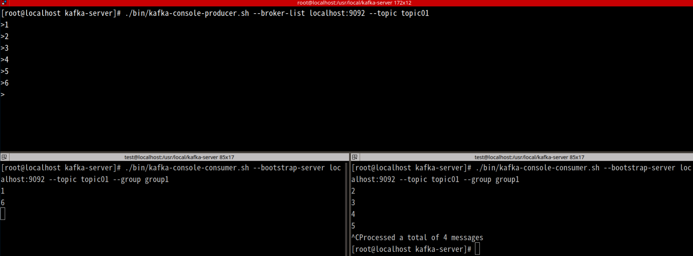

# Kafka Standalone Server

## Introduction

### Zookeeper is a must for Kafka

**Electing a controller**

When a node shuts down, it is the controller that tells other replicas `to become partition leaders` to replace the partition leaders on the node that is going away. 

**Cluster membership**

Which brokers are `alive and part of the cluster`? this is also managed through ZooKeeper.

**Topic configuration**

`Which topics exist`, how many partitions each has, where are the replicas, who is the preferred leader, what configuration overrides are set for each topic

## Install Kafka Standalone Server

### Install kafaka step by step

```bash
$ apt install default-jre wget git unzip default-jdk -y

$ wget https://downloads.apache.org/kafka/3.4.0/kafka_2.13-3.4.0.tgz

$ sudo su -

$ mkdir /usr/local/kafka-server

$ cd /usr/local/kafka-server

$ tar -xvzf ~/kafka_2.13-3.4.0.tgz --strip 1 -C /usr/local/kafka-server
#   File name transformations
#       --strip-components=NUMBER
#              Strip NUMBER leading components from file names on extraction.

$ mv ~/kafka_2.13-3.4.0.tgz ./
```

config server.properties

```bash
$ cat server.properties | grep -v ^# | grep -v ^$ | sort
broker.id=0
group.initial.rebalance.delay.ms=0
listeners=PLAINTEXT://localhost:9092
log.dirs=/var/log/kafka-logs
log.retention.check.interval.ms=300000
log.retention.hours=168
num.io.threads=8
num.network.threads=3
num.partitions=1
num.recovery.threads.per.data.dir=1
offsets.topic.replication.factor=1
socket.receive.buffer.bytes=102400
socket.request.max.bytes=104857600
socket.send.buffer.bytes=102400
transaction.state.log.min.isr=1
transaction.state.log.replication.factor=1
zookeeper.connection.timeout.ms=18000
zookeeper.connect=localhost:2181
```

install zookeeper systemd

```bash
# zookeeper systemd
$ cat << EOF > /etc/systemd/system/zookeeper.service
[Unit]
Description=Apache Zookeeper Server
Requires=network.target remote-fs.target
After=network.target remote-fs.target

[Service]
Type=simple
ExecStart=/usr/local/kafka-server/bin/zookeeper-server-start.sh /usr/local/kafka-server/config/zookeeper.properties
ExecStop=/usr/local/kafka-server/bin/zookeeper-server-stop.sh
Restart=on-abnormal

[Install]
WantedBy=multi-user.target
EOF

$ sudo systemctl daemon-reload
$ sudo systemctl start zookeeper
```

install kafka systemd

```bash
# kafka systemd
$ cat << EOF > /etc/systemd/system/kafka.service
[Unit]
Description=Apache Kafka Server
Documentation=http://kafka.apache.org/documentation.html
Requires=zookeeper.service
After=zookeeper.service

[Service]
Type=simple
Environment="JAVA_HOME=/usr/lib/jvm/java-11-openjdk-amd64"
ExecStart=/usr/local/kafka-server/bin/kafka-server-start.sh /usr/local/kafka-server/config/server.properties
ExecStop=/usr/local/kafka-server/bin/kafka-server-stop.sh
Restart=on-abnormal

[Install]
WantedBy=multi-user.target
EOF

$ sudo systemctl daemon-reload
$ sudo systemctl start kafka
```

### Operation

```bash
# Create a topic named topic01 with 3 partitions and 1 replication factor 
$ ./bin/kafka-topics.sh --bootstrap-server localhost:9092 --create --topic topic01 --partitions 3 --replication-factor 1

# Start a console producer to send messages to topic topic01
$ ./bin/kafka-console-producer.sh --broker-list localhost:9092 --topic topic01

# Start a console consumer in group group1 to consume messages from topic topic01
$ ./bin/kafka-console-consumer.sh --bootstrap-server localhost:9092 --topic topic01 --group group1

# List all consumer groups
$ ./bin/kafka-consumer-groups.sh --bootstrap-server localhost:9092 --list

# Delete the topic named topic01
$ ./bin/kafka-topics.sh --bootstrap-server localhost:9092 --delete --topic topic01
# Try not to delete the topic because you don't know how to delete the related log !

# Delete the consumer group named group1
$ ./bin/kafka-consumer-groups.sh --bootstrap-server localhost:9092 --group group1 --delete
```

## Mechanism strategy changes

A kafka was really installed. It does `not distribute the producer's messages evenly` to consumers in the same group. One consumer was deliberately disconnected to prove two consumers were working properly. 

Topics use `the Range Partitioning strategy` by default to allocate partitions. 

Brokers can determine `which partitions correspond to the key range`.

The data partitioner is responsible for `dividing the key range according to the hash value of the key` and `the number of partitions`.

This concentrates `adjacent keys together` and can `speed up the consumption` when consumers are grouped.



