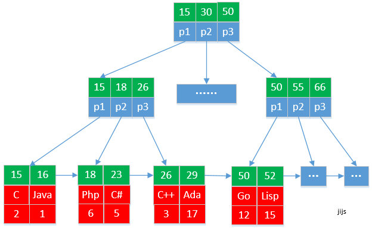
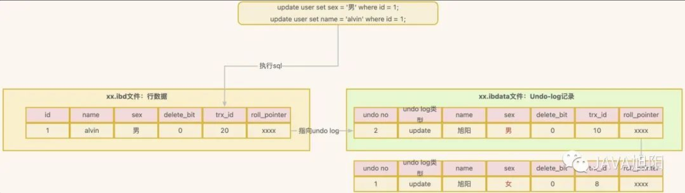
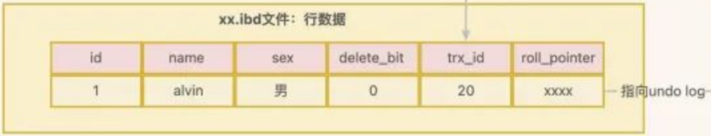
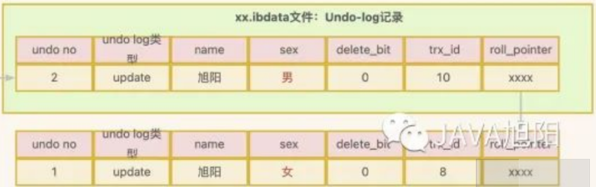
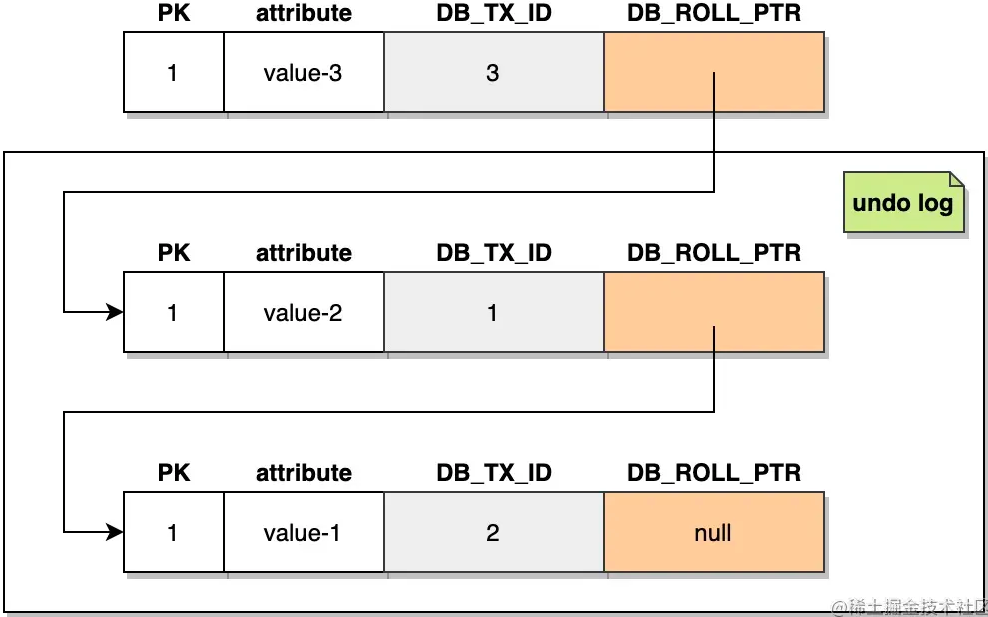

# Optimization

## Naming

### Principle

| Naming Principle     | Description                                                  |
| -------------------- | ------------------------------------------------------------ |
| Readability          | Names of databases, tables, and fields should adhere to the principle of readability, avoiding or minimizing the use of abbreviations.(不简写) |
| Descriptive Naming   | Names should accurately describe the represented object (e.g., table names reflecting stored data, following the "business_name_purpose" convention).(有意义) |
| Boolean Fields       | Fields representing true/false concepts should be named using the "is_xxx" convention, typically with an unsigned tinyint data type (1 for true, 0 for false).(用tinyint 表示布林) |
| Case and Format      | Table and field names must use lowercase letters or numbers, starting with a letter; avoid starting with a number or using consecutive underscores with numbers.(用小写) |
| Singular Table Names | Use singular nouns for table names to maintain consistency and clarity.(用单数) |
| Avoid Reserved Words | Avoid using reserved words (e.g., desc, range, match) for database, table, and field names.(不要关键字) |

## Normalization

### Definition

| normalization | definition                                                   | for example                                                  |
| ------------- | ------------------------------------------------------------ | ------------------------------------------------------------ |
| 1NF           | field should not be divided.                                 | Name-ID should be split.                                     |
| 2NF           | all non-key attributes must be fully functionally dependent on the entire primary key. | Consider a table that stores information about books, with the following attributes: ISBN (as the primary key), Title, Author, and Genre. |
| 3NF           | if a non-key attribute depends on another non-key attribute, it should be moved to its table with a relationship established.(建新表) | In this case, 3NF would require that Publisher Address depends only on Publisher and not on ISBN. You should create a separate table for Publisher and its address |

Pros and Cons

|                           | Normalization | De-normalization |
| ------------------------- | ------------- | ---------------- |
| Update Speed              | Fast          | Slow             |
| Data Redundancy           | Low           | High             |
| Memory Usage              | Small         | Large            |
| Query Table Relationships | Many          | Few              |
| Index Hit                 | Few Hits      | More Hits        |

## De-normalization

De-normalization is a strategy aimed at optimizing specific aspects of database performance, and there are several use cases for it, including:

1. Caching (Redis)

2. Reporting

3. Summarization

4. Slot

   | id   | count_name | slot | count |
   | ---- | ---------- | ---- | ----- |
   | 1    | check      | 1    | 10    |
   | 1    | check      | 2    | 14    |
   | 1    | check      | 3    | 24    |

## B Plus tree

### Introduction

The InnoDB storage engine supports several common types of indexes, including `(1)B+ tree index, (2)full-text index, and (3)hash index`.

Among these, the B+ tree index is particularly crucial.

| Trees         | Operations                                                   |
| ------------- | ------------------------------------------------------------ |
| tree          | A finite set consisting of N nodes.<br />(1) The tree has a special node called the `root`.<br />(2) The remaining nodes can be divided into M disjoint trees, referred to as `subtrees` of the original nodes. |
| binary search | Therefore, to construct a binary search tree for maximum performance, it needs to be balanced, which introduces a new concept - a balanced binary tree, also known as an AVL tree. (平衡是问题) |
| AVL tree      | (1) Perform tree rotations.<br />(2) The transformation from AVL trees to B+ trees reveals that when there are a large number of nodes, the height of an AVL tree is significantly greater than that of a B+ tree. (B加树高度矮) |
| B+ Tree       | Why doesn't MySQL use B-trees and instead opts for B+ trees?<br />(1) B Plus trees have smaller data amounts per node, allowing them to return multiple records per query, thereby reducing the number of I/O operations.<br />(2)  B+ trees are significantly better than B trees for range queries. (数据都在叶子，范围好查)<br />(3) Efficiency of disk sequential reading is very high because no seek time, minimal rotational latency. (B加树如果顺序读写，效能会提升)<br />Generally, disk sequential read efficiency can be 40 to 400 times that of random reads. Sequential writes are 10 to 100 times that of random writes. |
| Hash-Map      | Hash-Map isn't suitable for database indexing?<br />(1) Hash tables can only match for equality; they cannot perform range searches.(考量使用 HashMap 作 Index，但不支援范围)<br />(2) When needing to order by an index, hash values cannot support sorting. (没排序) <br />(3) Composite indexes can support partial index queries. For example, with a composite index (a, b, c), a query using only a and b can still be performed. If using a hash table, the composite index would merge several fields into a hash, making it unable to search by a or b or c. (Hash 复合，不能用 a b c 搜寻)<br />(4)   With a large amount of data, the probability of hash collisions becomes very high. (Hash 碰撞) |

## Reducing B-tree leaf size

### Principles

1. Smaller Is Usually Better
   In general, it is advisable to use the smallest data type that can correctly store the index in B Plus tree. 
   Then, it can improve the performance of B Plus trees.
2. Simplicity Is Key
   Similar concept, using int as the primary key is better than using a string.
3. Minimize the Use of NULL Values
   In most cases, it's best to use NOT NULL for columns unless you really need to store NULL values.
   It is because Null-able columns can occupy extra space in B Plus tree. (Null 会多占空间)

### Size

#### Integers

| Data Type    | Default M | Storage Size | Signed Range                                            | Unsigned Range                  |
| ------------ | --------- | ------------ | ------------------------------------------------------- | ------------------------------- |
| TINYINT(M)   | 4         | 1 byte       | -128 to 127                                             | 0 to 255                        |
| SMALLINT(M)  | 6         | 2 bytes      | -32,768 to 32,767                                       | 0 to 65,535                     |
| MEDIUMINT(M) | 11        | 3 bytes      | -8,388,608 to 8,388,607                                 | 0 to 16,777,215                 |
| INT(M)       | 11        | 4 bytes      | -2,147,483,648 to 2,147,483,647                         | 0 to 4,294,967,295              |
| BIGINT(M)    | 20        | 8 bytes      | -9,223,372,036,854,775,808 to 9,223,372,036,854,775,807 | 0 to 18,446,744,073,709,551,615 |

#### Floating-Point

| Data Type | Storage Size | Precision and Range  | Storage Method        | Calculation Efficiency    | Range                                                        |
| --------- | ------------ | -------------------- | --------------------- | ------------------------- | ------------------------------------------------------------ |
| DECIMAL   | Variable     | Exact decimal values | String-based storage  | Slower (High precision)   |                                                              |
| FLOAT     | 4 bytes      | Limited precision    | Native floating-point | Faster (Low precision)    | -3.402823466E+38 to -1.175494351E-38<br/> 0<br />1.175494351E-38 to 3.402823466E+38. |
| DOUBLE    | 8 bytes      | High precision       | Native floating-point | Faster (Higher precision) | -1.7976931348623157E+308 to -2.2250738585072014E-308<br />2.2250738585072014E-308 to 1.7976931348623157E+308 |

Using relatively fewer bits to represent the fractional part over a wide range can potentially lead to a loss of precision. (范围变大，精度变小)

If you need both precision and performance, go with `int`. (可以用 INT 作浮点数)

#### String types

1. VARCHAR
   (1) The VARCHAR data type is commonly used for storing variable-length strings, saving space as it only uses the necessary amount. (1到2个 Bytes 去记录可变长度)
   
   (2) It requires 1 or 2 additional bytes to store the length internally, depending on the maximum length of the column (1 byte for <= 255 bytes, 2 bytes otherwise).
   
   (3) While VARCHAR saves storage space and benefits performance, it can pose challenges when updating rows that become longer.
   
   (4) If a row's size increases, and there's no room left on the page to store it, MyISAM might split the row into different segments, while InnoDB might need to split the page to accommodate the longer row.
   
   (MyISAM 在底层 VARCHAR 资料是不连续的，而 InnoDB 是连续的)

2. CHAR
   (1) The CHAR data type is fixed-length, and MySQL always allocates sufficient space based on the defined string length. (固定大小)
   (2) When MySQL stores CHAR data type strings, it trims trailing spaces and pads with spaces as necessary to ensure the string's length matches the defined length.
   This aids in comparisons and maintaining data consistency. (填充未使用的空间才能比大小)

3. VARCHAR VS CHAR

   | Type    | Choice                                                       |
   | ------- | ------------------------------------------------------------ |
   | CHAR    | (1) When the maximum length of string columns is significantly larger than the average length, and the columns are rarely updated.(长度大于平均，又常被修改) |
   | VARCHAR | (1) CHAR is a suitable choice for storing very short strings, values of fixed or nearly the same length, or data that changes frequently.<br />For example, CHAR is ideal for storing fixed-length values like MD5 passwords because it doesn't easily lead to fragmentation.<br />(2) It's also more space-efficient for extremely short columns. For instance, using CHAR(1) to store values like 'Y' and 'N' in a single-byte character set requires less space compared to VARCHAR(1), which incurs an additional length byte. (VARCHAR也要额外空间去记录长度，还是CHAR好)<br />(3) It's also more space-efficient for extremely short columns. For instance, using CHAR(1) to store values like 'Y' and 'N' in a single-byte character set requires less space compared to VARCHAR(1), which incurs an additional length byte.(就算都是 VARCHAR，VARCHAR(5)也比VARCHAR(200)好) |

4. BLOB VS TEXT
   (1) BLOB and TEXT are string data types designed for storing large data, utilizing binary and character-based storage, respectively.
   (2) InnoDB, for instance, uses a dedicated "external" storage area for large BLOB and TEXT values, where each value in a row requires 1-4 bytes to store a pointer, and the actual data is stored externally.
   (InnoDB 会用外部储存)
   (3) The key distinctions between the BLOB and TEXT families are that BLOB stores binary data without collation or character set, while TEXT includes character set and collation. (TEXT会存编码，而BLOB不会)
   (4) If necessary, consider separating BLOB or TEXT columns into a separate table. Avoid retrieving large BLOB or TEXT values unnecessarily. For example, using SELECT * is not recommended unless you can ensure that the WHERE clause used as a constraint will only retrieve the required data rows. Otherwise, you might transfer large amounts of data needlessly over the network. (不会 SELECT * 把 TEXT 的内容一起读出来，可能会卡，而且网路还要传送大笔资料)
   (5) You can enhance the query performance of large text fields (BLOB or TEXT) by using synthetic indexes. In essence, a synthetic index is created by generating a hash value based on the content of large text fields and storing this value in a separate data column.(不然使用 HASH 索引，不能查询范围而已)

5. ENUM
   (1) Because enumerations are actually stored as integers, not strings, avoid using numbers as ENUM enumeration constants. It can easily lead to confusion, for example, ENUM('1', '2', '3').(不要用数字ENUM)

#### Time types

MySQL supports various types to store date and time values, such as `YEAR, DATE, DATETIME, and TIMESTAMP`.

| Date and Time Type | Storage Range                        | Smallest Time Granularity                                    |
| ------------------ | ------------------------------------ | ------------------------------------------------------------ |
| DATETIME           | 1001 to 9999                         | Second                                                       |
| TIMESTAMP          | 1970 to 2038 (affected by time zone) | Second                                                       |
| Custom Format      | N/A                                  | Microsecond (using BIGINT) or fractional seconds (using DOUBLE) (秒以下部份用 BIGINT 表示) |

## Index

Types of Indexes

| Indexes               | Features                                                     |
| --------------------- | ------------------------------------------------------------ |
| B Plus Tree           | the purpose of B+ trees is to provide a data structure for fast data retrieval. (索引因查询而生) |
| Clustered Index       | InnoDB uses a clustered index, which means that it constructs a B+ tree using the primary key of the table, and stores all the row record data of the entire table in the leaf nodes of that B+ tree.(用主键产生B树，聚簇索引有所有资料)<br />This means that the index is the data, and the data is the index. Since the clustered index is built using the primary key of the table, each table can have only one clustered index.(一张表只有一个聚簇索引)<br />One advantage of a clustered index is that it allows you to retrieve complete rows of data through the clustered index.<br />Another advantage is that sorting and range searches on the primary key are very fast. (利于排序)<br /><br />(图中有包含其他栏位) |
| Secondary Index       | (1) If you want to search using a different column, you would typically create multiple indexes, which are referred to as secondary indexes or non-clustered indexes. (如果其他栏位要排序)<br />* Instead, they only store key values and a reference to the primary key. (只记录主键)<br />* So, secondary indexes essentially record the key values and a way to locate the full row data through the primary key. (用主键去跟聚簇索引要资料)<br /><br />(2) When you use a secondary index to look up data, the InnoDB storage engine traverses the secondary index and uses the pointers at the leaf level to access the primary key index, which leads to the primary clustered index.<br />From there, it retrieves the complete row record.<br />This process is also known as a lookup or database lookup. (回文)<br />(3) During the execution of a SELECT query, generally, at most one secondary index can be utilized, even if multiple secondary indexes are used in the WHERE clause. (重要，2级索引只会用一个)<br />(4) Calculating selectivity/cardinality to choose secondary indexes:<br/>SELECT count(DISTINCT name) / count(*) FROM person;<br/>SELECT count(DISTINCT sex) / count(*) FROM person;<br/>SELECT count(DISTINCT age) / count(*) FROM person;<br/>SELECT count(DISTINCT area) / count(*) FROM person; |
| Composite Index       | When you create an index by combining multiple columns on a table, it's referred to as a composite index or compound index.<br />For example, creating an index on (a, b) means that it's an index constructed by combining columns a and b. (联合索引)<br />It's crucial to note that creating a composite index will result in a single B Plus tree structure.(最后只有一个B加树)<br /><br />You're absolutely correct. When you create an index on (note, b), it indeed signifies the following:<br/><br/>1. Initially, the records are sorted based on the 'note' column.<br/>2. In the event of records having the same 'note' value, further sorting is done using the 'b' column.<br/>This principle illustrates the significance of the "leftmost prefix rule". (最佳左前缀法则) |
| Prefix Index          | (1) For blob, text, and very long varchar fields, MySQL does not support indexing their entire length and requires creating a prefix index. (text, blob 太长不能作索引)<br />(2) SQL: ALTER TABLE table ADD INDEX age_index(age);<br />(3) MySQL cannot use prefix indexes for ORDER BY and GROUP BY, nor can it use them for covering index. (不可用复盖索引)<br />(4) Calculation of Dispersion:<br />SELECT COUNT(DISTINCT LEFT(order_note,3))/COUNT(*) AS sel3,<br/>COUNT(DISTINCT LEFT(order_note,4))/COUNT(*)AS sel4,<br/>COUNT(DISTINCT LEFT(order_note,5))/COUNT(*) AS sel5,<br/>COUNT(DISTINCT LEFT(order_note, 6))/COUNT(*) As sel6,<br/>COUNT(DISTINCT LEFT(order_note, 7))/COUNT(*) As sel7,<br/>COUNT(DISTINCT LEFT(order_note, 8))/COUNT(*) As sel8,<br/>FROM order_exp;<br />(计算离散) |
| Suffix Index          | (1) MySQL natively does not support reverse indexing, but you can store the string reversed and build a prefix index based on it. (后缀自己建)<br />(2) Sometimes suffix indexes (suffix index) also have utility (for example, finding all email addresses for a domain). (电子信箱) |
| Multi-row Index       | (1) The order of index columns in a multi-column B-Tree index is crucial for optimizing queries with ORDER BY, GROUP BY, and DISTINCT clauses that match the column order. (ORDER BY, GROUP BY 顺序相符，27%) <br />(2) When considering the order of columns in a composite index, prioritize the column with the highest selectivity at the beginning to optimize search for WHERE conditions. (选择性最高的列放前) <br />(3) To save space and enhance search efficiency, prefer creating a composite index over multiple single-column indexes for multi-condition queries. (多行较占内存，先用联合，23%) <br />(4) Different orderings of multi-column indexes may be necessary to cater to varying query requirements. (建不同顺序多行索引，50 %) |
| AHI                   | (1) InnoDB storage engine, in addition to the various types of indexes we mentioned earlier, also employs an Adaptive Hash Index (AHI). (InnoDB 有(自适应)哈希索引作为缓存)<br />(2) InnoDB uses a division-based hashing technique for its hash function, and it utilizes linked lists for collision resolution.<br />It's important to note that the Adaptive Hash Index is an internal mechanism created and used by the database engine itself, and users do not have direct control over it. (只有开关，不能控制)<br />(3) If you want to check the InnoDB status, you can use the "SHOW ENGINE INNODB STATUS" SQL command. This command provides detailed information about the InnoDB storage engine's status, including information related to transactions, locks, buffer pool utilization, and more. (可以查 自适应 状态)<br /><br />Therefore, there are situations where non-hash searches occur. By looking at the ratio of "hash searches" to "non-hash searches," you can get a rough idea of the efficiency improvement gained from using hash indexes. (用 hash searches 和 non-hash searches 来评估)<br/><br/>InnoDB has the Adaptive Hash Index (AHI) enabled by default. You can consider enabling or disabling this feature using the "innodb_adaptive_hash_index" parameter (可以考虑关闭). |
| full-text (弱鸡)      | Full-Text Search is a technology used to retrieve arbitrary content information from entire books or articles stored in a database.<br />It allows you to access information related to chapters, sections, paragraphs, sentences, words, and more as needed. (ES 最强)<br />An inverted index is a data structure used to extract and process all the keywords contained in a document. (倒排索引先提取关键字)<br />Subsequently, it stores the correspondence between keywords and the documents in which they appear, and finally, it sorts and indexes the keywords themselve.<br />When a user searches for a specific keyword, they first search the index of the keyword and then, through the correspondence between keywords and documents, locate the documents in which they appear.(之后就排序搜寻) |
| Covering Index (现象) | Covering index is to include the columns needed for the query in the index, thereby avoiding access to actual data rows and enhancing query performance.(索引中包含所需的列)<br />Therefore, whether on composite indexes or other types of indexes, a covering index can be leveraged to reduce lookup operations and accelerate queries.(只要是索引就有机会成为复盖索引) |
| Three-Star Index      | **First Star**: All columns of equality predicates, positioned at the beginning of a composite index, allowing for narrow index slices. (限缩范围)<br />**Second Star**: The field is in the composite index and is automatically sorted by the index. (索引和SQL排序相符)<br />**Third Star**: The field specified in the SELECT statement exists in the composite index. (无回文) |

## Three-Star Evaluation

### Example 1:

There is a table, and the SQL is as follows:

```sql
CREATE TABLE customer (
	cno INT,
	lname VARCHAR (10),
	fname VARCHAR (10),
	sex INT,
	weight INT,
	city VARCHAR (10)
);

CREATE INDEX idx_cust ON customer (city, lname, fname, cno);
```

Let's evaluate:

```sql
select cno,fname from customer where lname='xx' and city ='yy' order by fname;
```

**First Star:** lname='xx' and city ='yy', narrowing the scope, yields 27%.

**Second Star:** After narrowing the scope, sorting by fname with order by, yields 23%.

**Third Star:** cno, fname are in the (city, lname, fname, cno) index, no need for a lookup, yields 50%. (不用回文)

Total score: 100%.

### Example 2:

There is a table, and the SQL is as follows:

```sql
CREATE TABLE `test` (
	`id` INT (11) NOT NULL AUTO_INCREMENT,
	`user_name` VARCHAR (100) DEFAULT NULL,
	`sex` INT (11) DEFAULT NULL,
	`age` INT (11) DEFAULT NULL,
	`c_date` datetime DEFAULT NULL,
	PRIMARY KEY (`id`),
) ENGINE = INNODB AUTO_INCREMENT = 12 DEFAULT CHARSET = utf8;

CREATE INDEX NEW_IDX USING BTREE ON test (user_name,sex,age);
```

Let's evaluate:

```sql
select user_name,sex,age from test where user_name like 'test%' and sex =1 ORDER BY age;
```

**First Star:** user_name like 'test%' and sex =1, narrowing the scope, yields 27%.

**Second Star:** The middle sequence represents 'sex' as 0 1 0 1, followed by 'age' which is not guaranteed to be in order, resulting in a 23% loss.

**Third Star:** user_name,sex,age are in the (user_name,sex,age) index, no need for a lookup, yields 50%. 

Total score: 77%.

### Example 3:

There is a table, and the SQL is as follows:

```sql
CREATE TABLE `test` (
	`id` INT (11) NOT NULL AUTO_INCREMENT,
	`user_name` VARCHAR (100) DEFAULT NULL,
	`sex` INT (11) DEFAULT NULL,
	`age` INT (11) DEFAULT NULL,
	`c_date` datetime DEFAULT NULL,
	PRIMARY KEY (`id`),
) ENGINE = INNODB AUTO_INCREMENT = 12 DEFAULT CHARSET = utf8;

CREATE INDEX NEW_IDX USING BTREE ON test (sex,age,user_name);
```

Let's evaluate:

```sql
select user_name,sex,age from test where user_name like 'test%' and sex =1 ORDER BY age;
```

**First Star:** Initially placing sex = 1 at the forefront of the index results in a broad range, causing a 27% loss.

**Second Star:** The index order is sex, age, user_name. After filtering for sex = 1, age is ordered, yielding 23%.

**Third Star:** user_name,sex,age are in the (user_name,sex,age) index, no need for a lookup, yields 50%. 

Total score: 73%.

## Transaction

### ACID

| **ACID**    | **Description**                                              |
| ----------- | ------------------------------------------------------------ |
| Atomicity   | A transaction is an indivisible unit; all operations within it must either succeed entirely or fail entirely. For example, in a fund transfer, both debit and credit actions must occur as a whole. (全部成功，全部失败) |
| Consistency | Transaction ensures the database transitions from one consistent state to another. The total balance before and after an operation should remain the same, preserving data integrity. (金额前后加起来相符) |
| Durability  | Once committed, modifications made by a transaction are permanently stored in the database, even in the event of system failure. (要永久储存) |
| Isolation   | Each transaction's execution remains unaffected by other concurrently executing transactions. Isolation prevents interference between operations and data used by different transactions. (复杂，再谈) |

### Question of Isolation

If isolation is not ensured, what problems can occur?

This is the correct situation.

| Transaction           | A's Account | B's Account |
| --------------------- | ----------- | ----------- |
| Initial Balance       | 10,000      | 500         |
| First Lending (1000)  | 9,000       | 1,500       |
| Second Lending (1000) | 8,000       | 2,500       |

This is no Durability.

| Transaction            | A Account(TX1) | B Account(TX1) | A Account(TX2) | B Account(TX2) |
| ---------------------- | -------------- | -------------- | -------------- | -------------- |
| Initial Balance of TX2 |                |                | 10,000         | 1500           |
| Initial Balance of TX1 | 10,000 (error) | 500            |                |                |
| First Lending (1000)   | 9,000          | 1500           |                |                |
| Second Lending (1000)  |                |                | 9000           | 2,500          |

The error is that both transactions read the initial value of B's account as 10,000.

### Problem of Isolation

| **Type**              | **Description**                                              | **Illustration**                                             |
| --------------------- | ------------------------------------------------------------ | ------------------------------------------------------------ |
| **Dirty Read**        | Occurs when a transaction reads data modified but not yet committed by another transaction. (读到其他事务未提交之值) |  |
| **Unrepeatable Read** | Happens when the same record is retrieved twice within a transaction, and the results differ between the reads. (同一个事务的值每次都不同) |  |
| **Phantom Read**      | Occurs when another transaction adds new records within the range being read by the ongoing transaction. (同一事务多出一些数据) |  |

### Isolation in SQL Standards

| **Isolation Level** | **Possible Issues**                         |
| ------------------- | ------------------------------------------- |
| READ UNCOMMITTED    | Dirty Read, Unrepeatable Read, Phantom Read |
| READ COMMITTED      | Unrepeatable Read, Phantom Read             |
| REPEATABLE READ     | Phantom Read                                |
| SERIALIZABLE        | None                                        |

### Isolation in Mysql

| **Isolation Level** | **Possible Issues**                               |
| ------------------- | ------------------------------------------------- |
| READ UNCOMMITTED    | Dirty Read, Unrepeatable Read, Phantom Read       |
| READ COMMITTED      | Unrepeatable Read, Phantom Read                   |
| REPEATABLE READ     | **Phantom Read (Resolve a portion of the issue)** |
| SERIALIZABLE        | None                                              |

### Set up statement

We can modify the transaction isolation level using the following statement:

```
SET [GLOBAL|SESSION] TRANSACTION ISOLATION LEVEL level;
```

The 'level' mentioned here can have four optional values:

```
level: {
    READ UNCOMMITTED
   | READ COMMITTED
   | REPEATABLE READ
   | SERIALIZABLE
}
```

|      | Scope   | Impact                                                       |
| ---- | ------- | ------------------------------------------------------------ |
| 4    | GLOBAL  | - Execute: `SET GLOBAL TRANSACTION ISOLATION LEVEL SERIALIZABLE;` <br> - Effect: Applies to sessions initiated after the statement; existing sessions remain unaffected. |
| 5    | SESSION | - Execute: `SET SESSION TRANSACTION ISOLATION LEVEL SERIALIZABLE;` <br> - Effect: Affects all subsequent transactions within the current session. |
| 6    | N/A     | - Execute: `SET TRANSACTION ISOLATION LEVEL SERIALIZABLE;` <br> - Effect: Only impacts the next transaction in the current session; subsequent transactions revert to the previous isolation level. |

### Startup parameter

To change the default transaction isolation level when starting the server, modify the "transaction-isolation" startup parameter. For instance, using "--transaction-isolation=SERIALIZABLE" will change it from "REPEATABLE READ" to "SERIALIZABLE."

To check the current session's default isolation level, use the following command:

```sql
SHOW VARIABLES LIKE 'transaction_isolation'; (>  MySQL 5.7.20)
SHOW VARIABLES LIKE 'tx_isolation'; (<=  MySQL 5.7.20)

+---------------+-----------------+
| Variable_name | Value           |
+---------------+-----------------+
| tx_isolation  | REPEATABLE-READ |
+---------------+-----------------+
```

Or use the shorter syntax:

```sql
SELECT @@transaction_isolation; (>  MySQL 5.7.20)
SELECT @@tx_isolation; (<=  MySQL 5.7.20)

+-----------------+
| @@tx_isolation  |
+-----------------+
| REPEATABLE-READ |
+-----------------+
```

### Command

| **Transaction Action**   | **SQL Statements**                             | **Result**                                         |
| ------------------------ | ---------------------------------------------- | -------------------------------------------------- |
| **Transaction Begin**    | `BEGIN`<br>`START TRANSACTION`<br>`BEGIN WORK` | -                                                  |
| **Transaction Rollback** | `ROLLBACK`                                     | Data inserted during the transaction is discarded. |
| **Transaction Commit**   | `COMMIT`                                       | Data inserted during the transaction is preserved. |

### Save Point

In MySQL, you can employ savepoints within your transaction to selectively rollback to a specific point in your sequence of statements, allowing you to retain changes made before that point. This provides more granular control over your transactions.

```
SAVEPOINT savepoint_name;
```

To roll back to a specific savepoint, you can use the following statement (the words "WORK" and "SAVEPOINT" are optional in the statement below):

```
ROLLBACK TO SAVEPOINT savepoint_name;
```

To remove a savepoint, you can use the following statement:

```
RELEASE SAVEPOINT savepoint_name;
```

However, if you don't specify a savepoint name after the ROLLBACK statement, it will directly roll back to the state before the transaction began. (ROLLBACK 回滚到事务前)

### Implicit Commits

When we initiate a transaction using the **START TRANSACTION or BEGIN** statement, or set the `autocommit` system variable to `OFF`, the transaction **won't automatically commit**.

However, some statements quietly trigger a commit, as if you had used the COMMIT statement. This scenario, where transactions are implicitly committed due to certain special statements, is referred to as an **implicit commit**.


Statements that can cause an implicit commit include:

| **Type of Implicit Commit**                                  | **Description**                                              |
| ------------------------------------------------------------ | ------------------------------------------------------------ |
| **Executing DDL Statements**                                 | DDL (Data Definition Language) statements that define or modify database objects, such as **databases, tables, views, stored procedures, etc**.<br />Using **CREATE, ALTER, DROP**, or similar statements to modify these objects will implicitly commit preceding statements within the transaction. (DDL 操作) |
| **Implicit Use or Modification of Tables in the MySQL Database** | Statements like **ALTER USER, CREATE USER, DROP USER, GRANT, RENAME USER, REVOKE, SET PASSWORD**, etc., also implicitly commit preceding statements within the transaction. (修改用户权限) |
| **Transaction Control or Lock-Related Statements**           | Initiating another transaction with **START TRANSACTION or BEGIN** in a session while a previous transaction remains uncommitted or unrolled back will implicitly commit the previous transaction.<br />Additionally, changing the **autocommit system variable from OFF to ON** manually and using lock-related statements like **LOCK TABLES** and **UNLOCK TABLES** will have the same effect. |
| **Data Loading Statements**                                  | Using the **LOAD DATA** statement to bulk import data into the database will implicitly commit the preceding transaction statements. |
| **Statements Related to MySQL Replication**                  | Statements like **START SLAVE, STOP SLAVE, RESET SLAVE, CHANGE MASTER TO**, etc., will implicitly commit the preceding transaction statements. |
| **Other Statements**                                         | Statements like **ANALYZE TABLE, CACHE INDEX, CHECK TABLE, FLUSH, LOAD INDEX INTO CACHE, OPTIMIZE TABLE, REPAIR TABLE, RESET**, and others also implicitly commit the preceding transaction statements. |

DDL Example

```sql
CREATE TABLE Table1 (
    id INT AUTO_INCREMENT PRIMARY KEY, 
    name VARCHAR(255) 
);

SET AUTOCOMMIT=0;

START TRANSACTION;

INSERT INTO Table1 (name) VALUES ('John');

CREATE TABLE Table2 (
    id INT AUTO_INCREMENT PRIMARY KEY, 
    name VARCHAR(255) 
);

ROLLBACK; 

SELECT * FROM Table1; -- Cannot Rollback
+----+------+ 
| id | name | 
+----+------+ 
|  1 | John | 
+----+------+ 
```

LOAD DATA Example

```sql
LOAD DATA INFILE '/path/to/your/data.csv'
INTO TABLE ImportTable
FIELDS TERMINATED BY ','
LINES TERMINATED BY '\n';
```

## MVCC

### Hidden Column

We know that, for tables using the InnoDB storage engine, their clustered index records always include two essential hidden columns:

Here's the content organized into a table:

| **Hidden Column** | **Description**                                              |
| ----------------- | ------------------------------------------------------------ |
| trx_id            | When a transaction modifies a clustered index record, it assigns the transaction's ID to the trx_id hidden column. |
| roll_pointer      | Each time changes are made to a clustered index record, the previous version is written to the undo log. This hidden column effectively serves as a pointer, enabling you to access the record's information before the modification. |



 



### Undo

(Additional point: Undo log: To achieve transaction atomicity, the InnoDB storage engine, in actuality, keeps a record of corresponding undo logs for **insert, delete, or update operations**. Typically, each change to a record corresponds to a single undo log. (一条修改对一个 undo)

Certain update operations can generate two undo logs. A transaction may include **creating, deleting, or updating multiple records**, leading to the creation of multiple corresponding undo logs. These undo logs are sequentially numbered, referred to as the 0th, 1st, and so forth, and collectively known as undo numbers. (多笔 undo 日志编号)



### Fix Problem

To solve all the issues, the use of a Read View is necessary.

| **Isolation Level** | **Possible Issues**                         | **Scenario**                                                 |
| ------------------- | ------------------------------------------- | ------------------------------------------------------------ |
| READ UNCOMMITTED    | Dirty Read, Unrepeatable Read, Phantom Read | Doesn't care about anything, so all problems, including Dirty Read, Unrepeatable Read, and Phantom Read, may occur. (都是问题) |
| READ COMMITTED      | Unrepeatable Read, Phantom Read             | Requires the use of **Read View** to resolve issues.         |
| REPEATABLE READ     | Phantom Read                                | Requires the use of **Read View** to resolve issues.         |
| SERIALIZABLE        | None                                        | Executes transactions in a fully serial manner, effectively resolving all problems. (没有问题) |

In MySQL, a significant difference between the READ COMMITTED and REPEATABLE READ isolation levels is the timing of when they generate the Read View. (差在时机不同)

- READ COMMITTED -> The Read View is created for individual transactions as soon as they perform a Select operation, resulting in many Read Views. (多 Read View)
- REPEATABLE READ -> After a Select operation, it checks if the Read View already exists. If not, a new Read View is created. (单一 Read View)

| **Type**              | **Description**                                              | **How MVCC deal with ?**                                     |
| --------------------- | ------------------------------------------------------------ | ------------------------------------------------------------ |
| **Dirty Read**        | Occurs when a transaction reads data modified but not yet committed by another transaction. (读到其他事务未提交之值) | Because it will check the active version, it must not be in the active version to be usable, and it is not possible to read records that have not been committed. (永远读最新 commit 的数据, **Example 1** and **Example 2**) |
| **Unrepeatable Read** | Happens when the same record is retrieved twice within a transaction, and the results differ between the reads. (同一个事务的值每次都不同) | (1) If the trx_id attribute value of the accessed version is the same as the creator_trx_id value in the ReadView, it indicates that **the current transaction is accessing records it has modified itself**, allowing the current transaction to access this version. (表示当前事务正在访问其自身修改过的记录)<br />(2) If the trx_id attribute value of the accessed version is less than the min_trx_id value in the ReadView, it signifies that the transaction that generated this version was committed before the current transaction created the ReadView. Hence, the current transaction can access this version without reading the content of a ROLLBACK. (不会读取到ROLLBACK的内容)<br />(3) If a transaction's trx_id falls between min_trx_id and max_trx_id, it implies that the version was created after min_trx_id but before max_trx_id. This typically indicates that the version was created by an uncommitted transaction. In this case, caution is needed to ensure that potentially rolled back changes are not read. (需要小心处理以确保不会读取到可能被回滚的更改)<br />(4) Generally, if a transaction's trx_id is greater than max_trx_id, it means the version was created by an uncommitted transaction and after the creation of the ReadView. In this scenario, this version is not visible to the current transaction to ensure transaction consistency and isolation. (该版本对当前事务不可见，以保证事务的一致性和隔离性)<br /><br />In Example 3 |
| **Phantom Read**      | Occurs when another transaction adds new records within the range being read by the ongoing transaction. (同一事务搜寻多出一些数据) | In the first Select, if the Read View is not found and another transaction inserts data and commits before the second Select, the Read View is created after the second Select, and the additional data will be retrieved.<br />(第一次 SELECT 没有产生 Read View，第二次 SELECT 就产生) |

#### Example 1:

**READ COMMITTED Level** fixes **Dirty Read**
(Always read the latest committed data.)

| Time |                       tx_id = 80                       |                      tx_id = 120                       |
| ---- | :----------------------------------------------------: | :----------------------------------------------------: |
| T1   |                         BEGIN;                         |                         BEGIN;                         |
| T2   | SELECT * FROM teacher WHERE n = 1; <br />(Result is C) | SELECT * FROM teacher WHERE n = 1; <br />(Result is C) |
| T3   |                   ReadView [80;120]                    |                   ReadView [80;120]                    |
| T4   |      UPDATE teacher  SET name = 'A' WHERE n = 1;       |      UPDATE teacher  SET name = 'B' WHERE n = 1;       |
| T5   |   ReadView [80;120]<br />(80, 120 are not committed)   |   ReadView [80;120]<br />(80, 120 are not committed)   |
| T6   | SELECT * FROM teacher WHERE n = 1; <br />(Result is C) | SELECT * FROM teacher WHERE n = 1; <br />(Result is C) |
| T7   |                        COMMIT;                         |                        COMMIT;                         |

**Each transaction** will generate a new Read View, and it just happens that they are all ReadView [80;120].

#### Example 2:

**READ COMMITTED Level** fixes **Dirty Read**
(Always read the latest committed data.)

| Time |                       tx_id = 80                       |                      tx_id = 120                       |
| ---- | :----------------------------------------------------: | :----------------------------------------------------: |
| T1   |                         BEGIN                          |                         BEGIN                          |
| T2   | SELECT * FROM teacher WHERE n = 1; <br />(Result is C) | SELECT * FROM teacher WHERE n = 1; <br />(Result is C) |
| T3   |                   ReadView [80,120]                    |                   ReadView [80,120]                    |
| T4   |      UPDATE teacher  SET name = 'A' WHERE n = 1;       |      UPDATE teacher  SET name = 'B' WHERE n = 1;       |
| T5   |                        COMMIT;                         |                                                        |
| T6   |       ReadView [120]<br />(120 is not committed)       |   ReadView [80,120]<br />(80,120 are not committed)    |
| T7   | SELECT * FROM teacher WHERE n = 1; <br />(Result is A) | SELECT * FROM teacher WHERE n = 1; <br />(Result is C) |
| T8   |                                                        |                         COMMIT                         |

**Each transaction** will generate a new Read View, and it just happens that they are all ReadView [120].

#### Example 3;

**Read View** is [10, 20, 30, 40, 50] (就 Read View)

**creator_trx_id** is 0 (资料建立者的 trx_id)

**the latest committed data** is 5 (最新 Commit 资料)

**min_trx_id** is 10 (最小未活跃的 trx_id)

**max_trx_id** is 50+1 (最大未活跃的 trx_id)

|  trx_id   | Situation                        | Result                                                       |
| :-------: | -------------------------------- | ------------------------------------------------------------ |
|     0     | trx_id == trx_id                 | Data creator modifying this data<br />(由数据创建者修改此数据) |
|     9     | trx_id < min_trx_id              | Read this Read View with confidence, won't read rolled-back data<br />(放心读取这个 Read View，不会读到回滚的数据) |
| 11 ... 49 | min_trx_id < trx_id < max_trx_id | Might read rolled-back data, so handle with caution, read the latest committed data<br />(可能会读到回滚的数据，因此需要小心处理，读到最新 Commit 的数据) |
|    52     | trx_id > max_trx_id              | Not visible in this Read View (在这个 Read View 中不可见)    |

#### Example 4:

At first, there is only a unique Read View, and the value of the Read View will change with the transactions' operations.

| Time |                          tx_id = 80                          |                         tx_id = 120                          |
| ---- | :----------------------------------------------------------: | :----------------------------------------------------------: |
| T1   |                            BEGIN;                            |                                                              |
| T2   |  SELECT * FROM teacher WHERE n = 1; <br />(Result is empty)  |                                                              |
| T3   |                      ReadView = []int{}                      |                                                              |
| T4   |                                                              | BEGIN<br />INSERT INTO teacher (name) VALUES ('B');<br />COMMIT; |
| T5   | UPDATE teacher  SET name = 'A' WHERE n = 1;<br />(Result is OK ! Suddenly, additional data appears !) |                                                              |
| T6   |           ReadView [80]<br />(80 is not committed)           |                                                              |
| T7   |    SELECT * FROM teacher WHERE n = 1; <br />(Result is A)    |                                                              |
| T7   |                           COMMIT;                            |                                                              |

